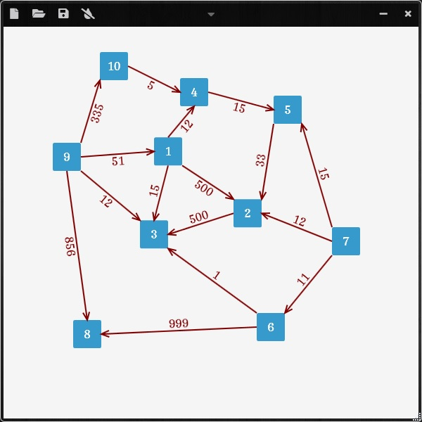
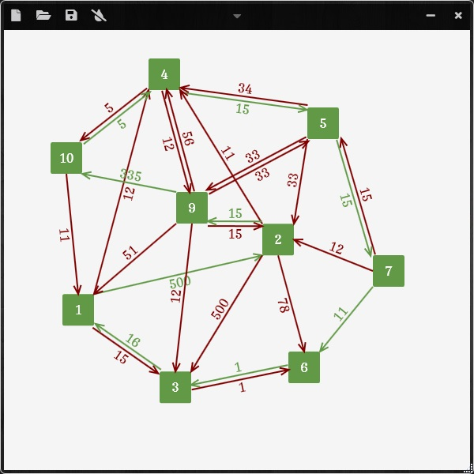

# GraphPlotter
> A utility app to draw graphs and solve certain minimization problems

## Requirements
[.NET Core 3.1](https://dotnet.microsoft.com/download/dotnet/3.1/runtime/) or higher
## Download
>[Latest Release](https://github.com/vahidtvj/GraphPlotter/releases/download/v1.0/GraphPlotter-v1.0.exe)

## How to use
*   `Right click` to add nodes
*   `Right click` and `draw` to draw vertices
*   Use `left click` to drag and organize nodes
*   `Double click` to change distance value
*   Select and press `del` to delete

## ScreenShots

  

    
  

  

    
  

## License

[MIT](https://github.com/vahidtvj/GraphPlotter/blob/main/LICENSE) © [vahidtvj](https://github.com/vahidtvj)
